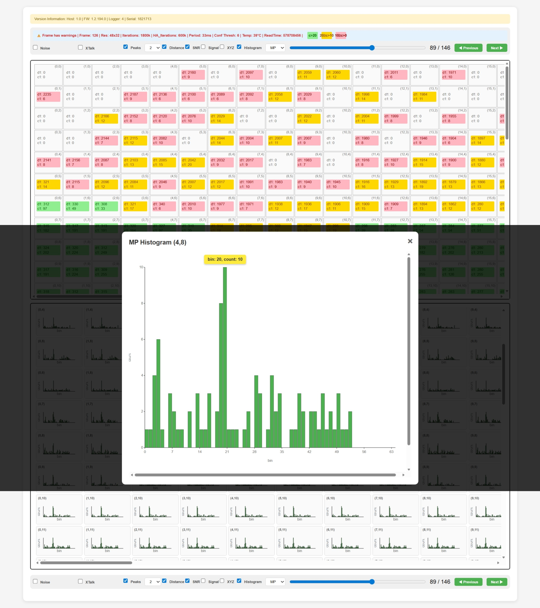

# TMF8829 JSON Logfile HTML converter

This tool enables the easy conversion of JSON logfile outputs to html for interactive viewing of

* Distance information in physical distance and x/y/z
* Noise, crosstalk (xtalk), SNR and signal amplitude of each pixel
* Histogram data for the pixels (MP) and reference (Ref)

inside a browser.

A typical output is shown below:


## Howto use

JSON logfiles can be created using the ams-OSRAM evaluation software downloaded from https://ams-osram.com/tmf8829 - see the user guide for the EVM howto create these files.

Alternatively JSON logfiles can be created with [tmf8829_zeromq_client.py](https://github.com/ams-OSRAM/tmf8829_driver_python/blob/main/tmf8829/zeromq/tmf8829_zeromq_client.py) or the exe program inside TMF8829_Driver_ZMQ_Server_Client_EXE_v-latest-version.zip from https://ams-osram.com/tmf8829 website.

### On a PC
Clone or download repository to PC with installed Python environment and execute

```bash
./json_to_html.py -i tmf8829_log_1770799073.json.gz 
```

and open the created html file *tmf8829_log_1770799073._viewer.html* with a browser.

### Online

#### Github Codespaces

Log into your GitHub account, open repository on GitHub [tmf8829_json_logfile_viewer](https://github.com/ams-OSRAM/tmf8829_json_logfile_viewer) and create Codespace using **Code->Create Codespace on main**.

Copy the JSON logfile into the explorer view of the Codespace and execute the command for conversion in the terminal:

```bash
./json_to_html.py -i tmf8829_log_1770799073.json.gz 
```

Download the created html file and view it with the browser.

#### Binder 

Open https://mybinder.org/v2/gh/ams-OSRAM/tmf8829_json_logfile_viewer/HEAD and proceede similar as shown for Github Codespaces.

